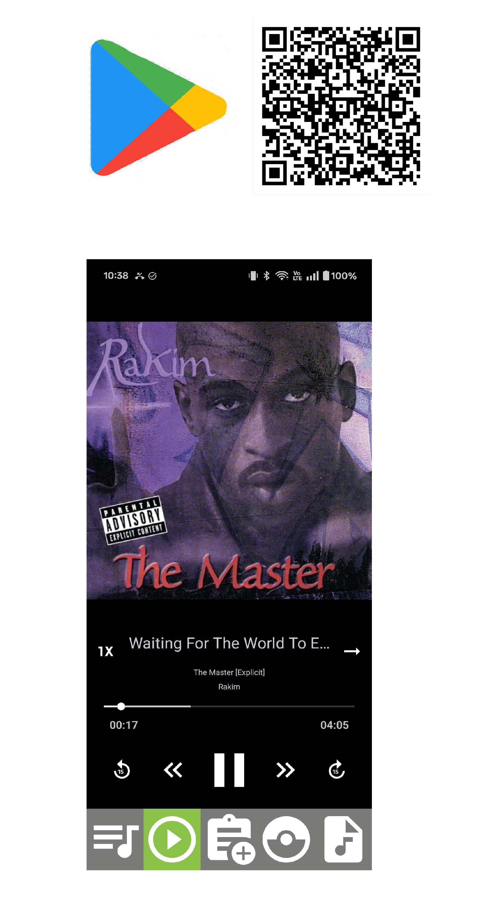

# Website Improvement Guide

This document lists improvements for both the code and visuals of this site. Each item includes a plain-language explanation of what to fix and why it matters. Items are roughly ordered from most to least impactful.

---

## Code Improvements

### 1. Fix a JavaScript API Bug
**File:** `script.js`

`video.onload()` and `video.onplay()` are not real browser APIs — they're event *properties*, not functions you call. The correct calls are `video.load()` and `video.play()`. The site works right now by accident (changing `video.src` triggers loading automatically), but this is fragile and will break if the code is reorganized.

```js
// Wrong
video.onload()
video.onplay()

// Correct
video.load()
video.play()
```

---

### 2. Uncomment `box-sizing: border-box`
**File:** `format.css`

There is a commented-out line near the top of the CSS file:
```css
/* * { box-sizing: border-box; } */
```
This should be enabled. Without it, adding padding to an element makes it wider than intended, which causes subtle layout bugs — especially on smaller screens. This is considered a standard fix that almost every modern website enables.

---

### 3. Add Alt Text to All Images
**File:** `index.html`

Every `` tag should have a descriptive `alt="..."` attribute. This matters for two reasons:
- **Accessibility:** Screen readers (used by people with visual impairments) read the alt text aloud.
- **SEO:** Search engines use alt text to understand what your images show, which helps your site rank higher.

```html
<!-- Before -->


<!-- After -->

```

---

### 4. Add a Meta Description Tag
**File:** `index.html` (`<head>` section)

The meta description is the short paragraph Google shows under your site name in search results. Without it, Google picks random text from your page, which usually looks bad.

```html
<meta name="description" content="David Taylor — Android developer specializing in Kotlin and Jetpack Compose. Portfolio of published apps and developer tools.">
```

---

### 5. Add Open Graph Tags
**File:** `index.html` (`<head>` section)

Open Graph tags control how your site looks when someone pastes a link into LinkedIn, iMessage, Slack, or Twitter. Without them, link previews are blank. Adding these five lines is enough:

```html
<meta property="og:title" content="David Taylor — Android Developer">
<meta property="og:description" content="Portfolio of Android apps and developer tools built with Kotlin and Jetpack Compose.">
<meta property="og:image" content="https://davidtaylor5.github.io/images/about_dev_photo.png">
<meta property="og:url" content="https://davidtaylor5.github.io">
<meta property="og:type" content="website">
```

---

### 6. Add a Visible Close Button to the Modal
**Files:** `index.html`, `format.css`, `script.js`

The project video popup currently only closes if you click on the dark background around it. There's no visible "X" button. Most users will try clicking the X first and assume the site is broken when it doesn't exist. Adding a close button in the top-right corner of the popup fixes this.

---

### 7. Add `loading="lazy"` to Images
**File:** `index.html`

This is a single attribute addition to every `` tag that tells the browser not to download images until the user scrolls near them. Free performance improvement — the page loads faster on first visit.

```html

```

---

### 8. Add a Favicon
**Files:** `index.html` (one line in `<head>`), plus a small icon image file

A favicon is the small icon that appears in the browser tab next to your site's title. Currently the tab shows a blank page icon. You can create a simple icon at [favicon.io](https://favicon.io) and add it with:

```html
<link rel="icon" href="images/favicon.ico" type="image/x-icon">
```

---

### 9. Add a `.gitignore` File
**File:** New file called `.gitignore` in the root folder

The `.DS_Store` file (macOS system metadata) is currently committed to the repo. It has no purpose there. Create a `.gitignore` file to prevent this and similar files from being tracked:

```
.DS_Store
*.DS_Store
```

---

## Visual / UX Improvements

### 1. Update the Color Palette
**File:** `format.css`

The current sky blue (`skyblue`, `lightBlue`) reads as casual and playful — more suited to a personal blog than a professional developer portfolio. Consider a more neutral or sophisticated palette:

- **Dark theme:** Dark charcoal (`#1a1a2e`) header/background with white text and a blue accent
- **Light professional:** Off-white (`#f8f9fa`) body background with a dark navy (`#1e3a5f`) header
- **Minimal:** Pure white background with black text and a single accent color (e.g., Android green `#3ddc84`)

---

### 2. Use a Better Font
**File:** `index.html` (`<head>`), `format.css`

Arial is the browser default — it signals "no design decisions were made here." Adding one Google Font import gives the whole site a much more polished feel. [Inter](https://fonts.google.com/specimen/Inter) is widely used on developer portfolios and looks clean and modern.

Add to `<head>`:
```html
<link href="https://fonts.googleapis.com/css2?family=Inter:wght@400;600;700&display=swap" rel="stylesheet">
```

Then in `format.css`:
```css
body { font-family: 'Inter', sans-serif; }
```

---

### 3. Add a Professional Headline to the Hero Section
**File:** `index.html`

Recruiters and visitors skim — they spend about 5 seconds deciding if they're in the right place. Right now the hero section jumps straight into a paragraph. A short headline above it immediately answers "who is this person?"

Example:
```
Android Engineer  ·  Kotlin  ·  Jetpack Compose
```

This can just be a styled `<h2>` above your existing bio paragraph.

---

### 4. Improve Project Card Hover Effects
**File:** `format.css`

The current hover effect removes the grayscale filter, which is a nice touch. Adding a subtle lift effect makes the cards feel more interactive and clickable — similar to Material Design's elevation concept (which you likely already know from Android).

```css
.column:hover {
    transform: translateY(-4px);
    box-shadow: 0 8px 24px rgba(0, 0, 0, 0.15);
    transition: transform 0.2s ease, box-shadow 0.2s ease;
}
```

---

### 5. Style the Navigation Bar
**File:** `format.css`

The nav bar links are plain underlined blue text right now — the browser default style. Removing the underlines, adding some padding, and adding a hover color makes the nav look intentional.

```css
nav a {
    text-decoration: none;
    padding: 8px 16px;
    color: white;
    border-radius: 4px;
}
nav a:hover {
    background-color: rgba(255, 255, 255, 0.15);
}
```

---

### 6. Add Social Icons to the Footer
**File:** `index.html`, `format.css`

The footer has raw text links. Replacing these with recognizable icons (LinkedIn logo, GitHub logo, email envelope) is more professional and takes up less space. [Font Awesome](https://fontawesome.com) provides free icons via a single CDN link — no download required.

Also: the footer currently has no GitHub link. GitHub is the first thing most developers and recruiters look for on a dev portfolio.

---

### 7. Add a Skills / Technologies Section
**File:** `index.html`, `format.css`

A row of tech badges between the hero section and the projects grid lets visitors instantly see your stack without reading the bio. This is especially useful for recruiters who scan for specific keywords.

Example badges: `Kotlin` · `Android` · `Jetpack Compose` · `MVVM` · `Room` · `Retrofit` · `Dagger Hilt`

These can be simple styled `<span>` tags with a pill shape (rounded border, small padding).

---

### 8. Fill or Remove the Empty 6th Project Card
**File:** `index.html`

The project grid has 6 slots but only 5 projects. The empty card is visually obvious and makes the grid look unfinished. Two options:
- **Add a sixth project** — even something like a link to your GitHub profile works.
- **Remove the empty card** and adjust the grid to end cleanly at 5 cards.

---

### 9. Make Project Cards Uniform Height
**File:** `format.css`

If project card text lengths differ, cards end up different heights, which looks misaligned in the grid. Adding `align-items: stretch` to the row container and using consistent internal padding makes the grid look clean and intentional.

---

### 10. Add Smooth Scrolling
**File:** `format.css`

One line. Makes any in-page link navigation feel smooth instead of jumping instantly.

```css
html { scroll-behavior: smooth; }
```

---

## Priority Order (Quick Reference)

| Priority | Item | Effort |
|----------|------|--------|
| High | Add meta description + Open Graph tags | 10 min |
| High | Add alt text to images | 15 min |
| High | Add professional headline to hero | 5 min |
| High | Add GitHub link to footer | 2 min |
| High | Fill or remove empty project card | 5 min |
| Medium | Add favicon | 20 min |
| Medium | Update color palette | 30 min |
| Medium | Add a better font (Inter) | 10 min |
| Medium | Style the navigation bar | 20 min |
| Medium | Add social icons to footer | 30 min |
| Medium | Improve card hover effects | 15 min |
| Medium | Add Skills section | 30 min |
| Low | Fix JS API bug (`video.load()`) | 10 min |
| Low | Uncomment `box-sizing: border-box` | 2 min |
| Low | Add `loading="lazy"` to images | 10 min |
| Low | Add `.gitignore` | 5 min |
| Low | Add visible modal close button | 30 min |
| Low | Add smooth scrolling | 2 min |
| Low | Make cards uniform height | 15 min |
